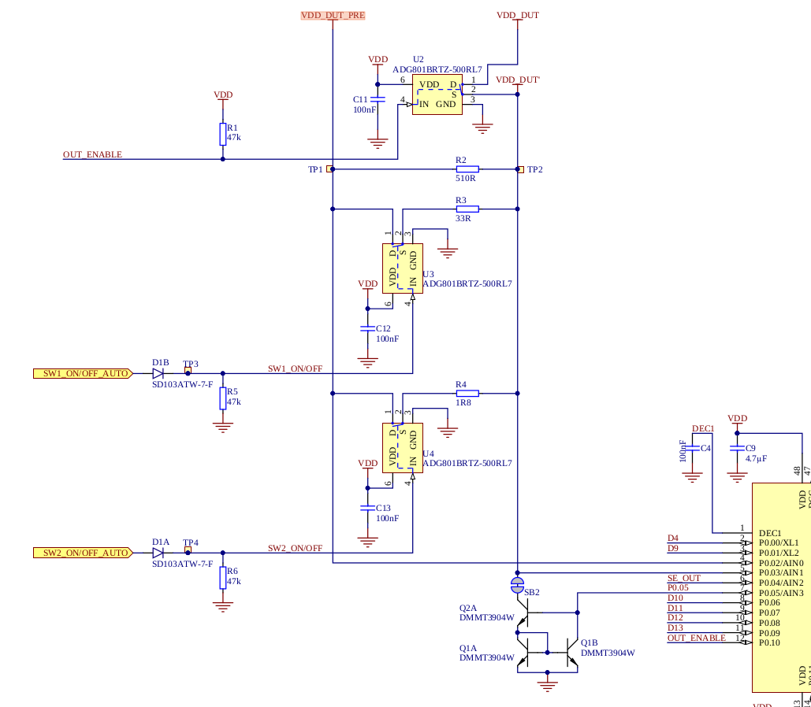
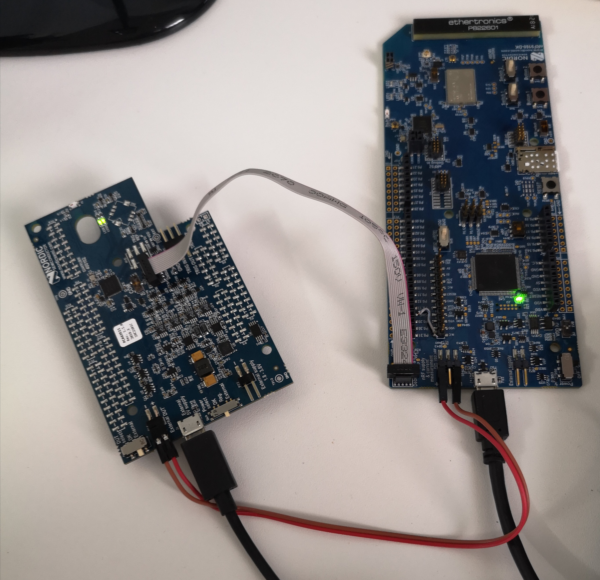
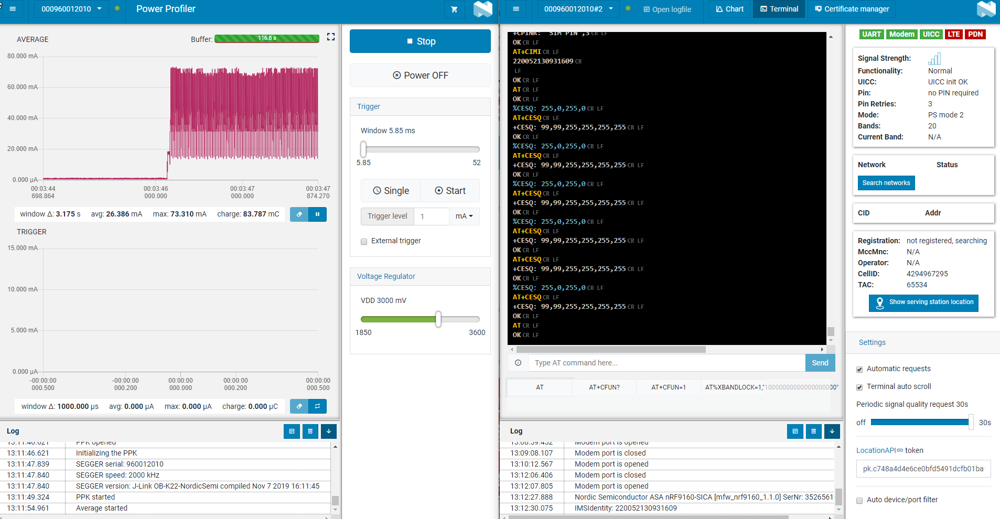
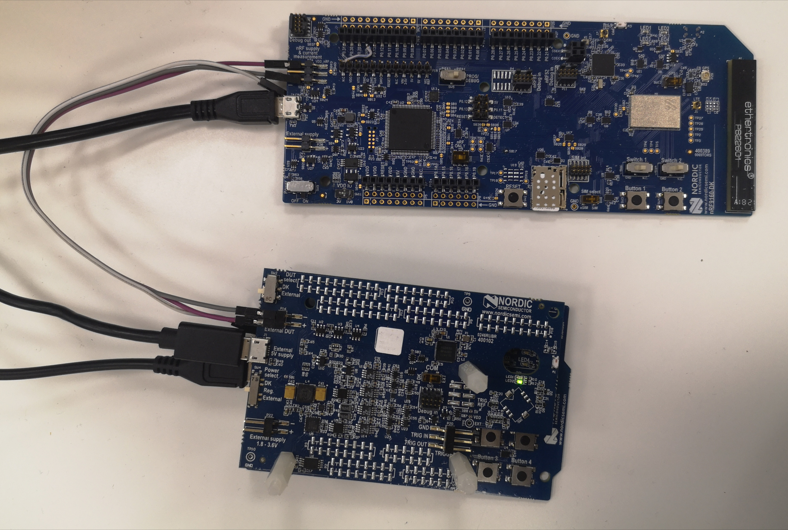

# ppk-nrf91
Nordic Semiconductor's [Power Profiler Kit (PPK)][ppk_page] is very useful for measuring and optimizing power consumption when developing battery-powered devices. This is why we wanted to find a way to use this useful tool also with nRF91-DK.

## PPK connection
There are several ways to measure current on the nRF91 development kit (nRF91-DK) using various test equipment like Power analyzer, Oscilloscope, and Ampere-meter. All of them use the same connector with some external hardware and that is quite well explained in the Nordic documentation section ["Measuring current" of the nRF9160][currnet_mes]. On the other hand to be able to use PPK with nRF91-DK we need to make some changes.

## Hardware modification
There are two problems why PPK cannot be used with nRF91-DK. First is that it is not pin compatible so we cannot stack these two boards using accessible headers. This can be overcome in tow ways, by using additional nRF5-DK or with simple IDC cable. More about these differences will be explained in the two use-cases. Second problem is that by the specification DUT cannot use more then 70 mA of current. As explained in the documentation and on DevZone forum the device wont be destroyed because it can handle loads up to 400 mA but maximum current that can be measured is still limited to 70 mA. Looking into the PPK schematics we can see that there are three digital switches. Component U2 is switch for enabling DUT power, and that component is bottleneck for maximum load current (400 mA) and R2, R3 and R4 are current measurement resistors. PPK has auto range switching so we always have best resolution and that is why there are three resistors and two additional switches (U3 and U4). Because PPK firmware is not open-source we can change just hardware parts, so changing these tree resistors to 50% smaller values can give us double the maximum measurement current. 


<p align="center">
  image 1: PPK current measurement schematic</center>
</p>

## Software changes
Now we have hardware that can measure up to 140 mA but we need to change software configuration so the current is correctly calculated. For this task we can use the [PPK API][ppk_api_page] that was developed by Nordics engineers to enable [automated testing][automated_testing_page]. First follow the readme page and install the software and it`s dependencies. After that uncomment the code in the [ppk_api/ppk_api.py line 94][ppk_api_line] and change the values of the resistors you have on your board.
```
self.set_user_resistors(116.800, 16.100, 1.000)
```
After saving the file call the main program form the console. In this call parameters are not that important but they need to be added. This is just one example of calling the program:
```
python3 main.py -a 2 -o ./res/graph1 -z -v
```
It will change the resistance parameters in the PPK firmware and the board is ready for to send real data to the nRF Connect Desktop application or PPK API. 

## Current measurement

### [1. Measuring current on an nRF91-DK][ppk_m1_page]

For this case required components are:

* nRF91 DK
* nRF PPK
* IDC 10 pin cable (50 mil)
* 2x jumper wires
* 2x micro USB cables

This is example of configuration where we have PPK working with onboard regulator and providing power supply for external DUT (NRF91 DK). At the same time Jlink programmer form nRF91-DK is used to connect PPK with PC (gray 10-pin cable is connecting J-link to the PPK on board nRF MCU). The picture below shows the connection between nRF-PPK and nRF91-DK.


<p align="center">
  image 2: board connection</center>
</p>

When using this configuration we are not able to reprogram and debug the main nRF91 MCU until we disconnect the PPK from the jlink. From the image above we can see that one USB is connected to the nRF91-DK which is providing power for the on-board J-link and communication with the PC. Second micro USB that is connected to the PPK is just providing input power to for the testing and for this to be enabled SW4 (Power select sw) need to be in the **Reg.** position. There is also a possibility to provide a regulated power supply externally to the P22 connector, but using on-board power regulator is a good option because there is an option in the software to change the power voltage of the DUT system. To provide power for the nRF91-DK we use External DUT (Design under test) option and connect P16 of nRF-PPK to the P24 of nRF91-DK. It is important to pay attention to the positive and negative pins and connect them correctly as in the picture and for this to work SB43 need to be cut. In the nRF-PPK SW2 (DUT select) need to be in the **External** position. 

When everything is connected [nRF Connect for desktop software][nrf_connect_desktop] can be used to test the setup. Before connecting the nRF-PPK to the nRF91-DK we flashed the module with the [AT command firmware][nrf_connect_atfw] for testing proposes. After that, on desktop, we start two applications **Power profiler** and **LTE Link monitor**. We use the LTE Link monitor app to put the nRF91 module in different states and see the power results with the PPK. The picture below shows the connection testing of the CAT-M connection try. NB-IoT is not yet tested. 



<p align="center">
  image 3: apps</center>
</p>


### [2. Measuring current on an nRF91 DK while debugging][ppk_m2_page]

For development purposes second case is more useful because it enables us to use debugging capabilities of the development board.

For this case required components are:

* nRF91 DK
* nRF PPK
* 2x jumper wires
* 3x micro USB cables
* nRF5-DK

 
<p align="center">
  image 4: Board connections</center>
</p>

The principle is the same as in the previous case just this time nRF52-DK is used as a jlink bridge between PPK and the PC. 

## License

All our projects are as usefully open-source as possible.

Hardware including documentation is licensed under [CERN OHL v.1.2. license](http://www.ohwr.org/licenses/cern-ohl/v1.2)

Firmware and software originating from the project is licensed under [GNU GENERAL PUBLIC LICENSE v3](http://www.gnu.org/licenses/gpl-3.0.en.html).

Open data generated by our projects is licensed under [CC0](https://creativecommons.org/publicdomain/zero/1.0/legalcode).

All our websites and additional documentation are licensed under [Creative Commons Attribution-ShareAlike 4 .0 Unported License] (https://creativecommons.org/licenses/by-sa/4.0/legalcode).

What this means is that you can use hardware, firmware, software and documentation without paying a royalty and knowing that you'll be able to use your version forever. You are also free to make changes but if you share these changes then you have to do so on the same conditions that you enjoy.

Koruza, GoodEnoughCNC and IRNAS are all names and marks of Institut IRNAS Rače. 
You may use these names and terms only to attribute the appropriate entity as required by the Open Licencees referred to above. You may not use them in any other way and in particular you may not use them to imply endorsement or authorization of any hardware that you design, make or sell.


[ppk_page]: https://www.nordicsemi.com/Software-and-Tools/Development-Kits/Power-Profiler-Kit
[ppk_m1_page]: https://infocenter.nordicsemi.com/topic/ug_ppk/UG/ppk/PPK_user_guide_PPK_on_nRF5xDK.html
[ppk_m2_page]: https://infocenter.nordicsemi.com/topic/ug_ppk/UG/ppk/PPK_user_guide_PPK_on_nRF5xDK_with_debug.html
[automated_testing_page]: https://devzone.nordicsemi.com/nordic/nordic-blog/b/blog/posts/ppk_5f00_api
[ppk_api_page]: https://github.com/VojislavM/ppk_api
[ppk_api_line]: https://github.com/VojislavM/ppk_api/blob/master/ppk/ppk.py#L94
[currnet_mes]: https://infocenter.nordicsemi.com/index.jsp?topic=%2Fug_ppk%2FUG%2Fppk%2FPPK_user_guide_Configuring_the_PPK.html&cp=6_6_5
[nrf_connect_desktop]: https://www.nordicsemi.com/Software-and-Tools/Development-Tools/nRF-Connect-for-desktop
[nrf_connect_atfw]: https://github.com/NordicPlayground/fw-nrfconnect-nrf/tree/master/samples/nrf9160/serial_lte_modem
